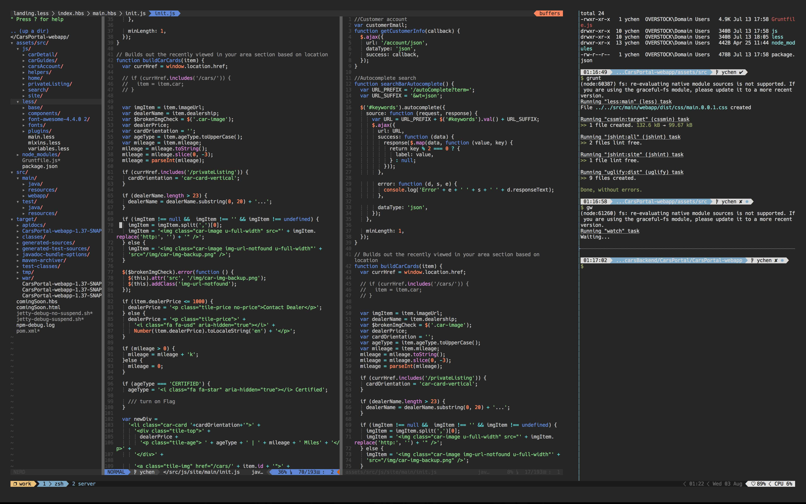
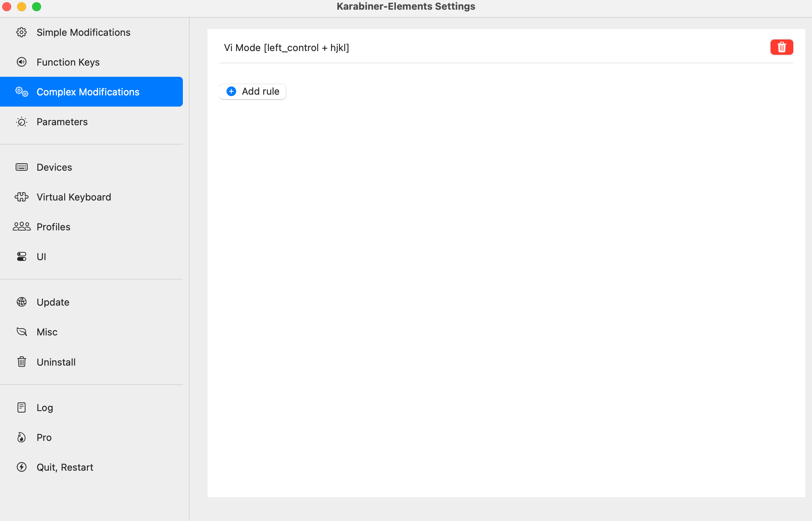
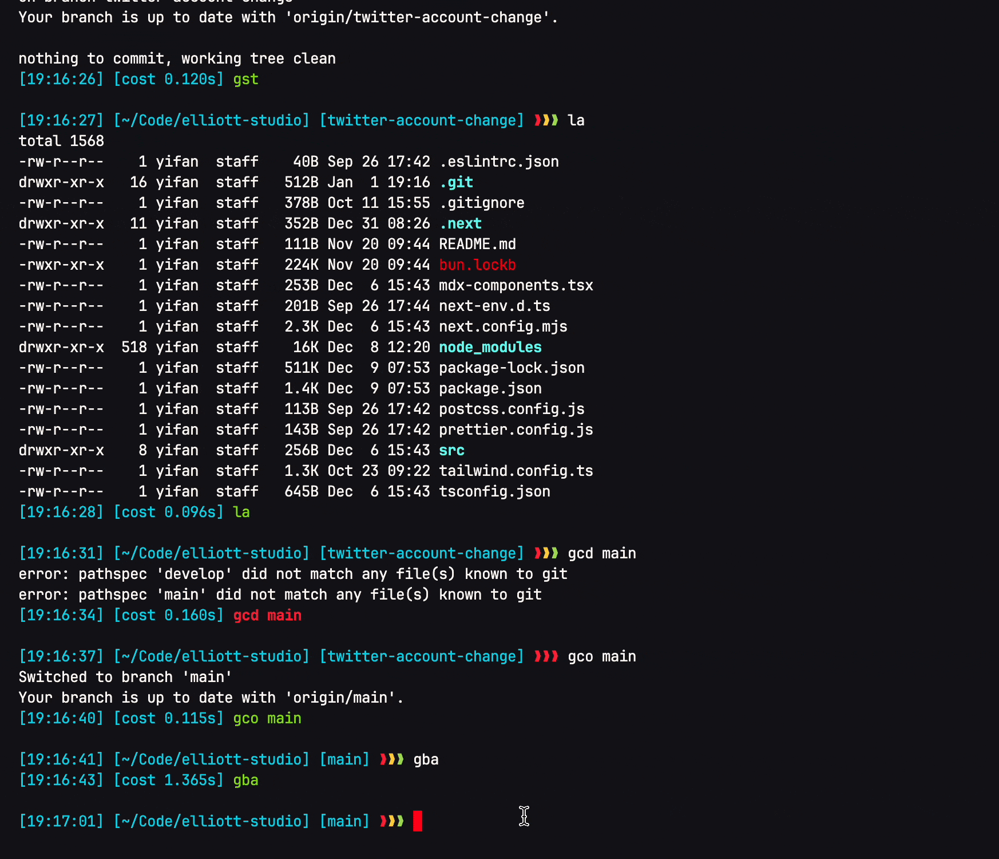

So, I was invited to write something new at the RTE(Real-time Engagement) community, after a short period of thinking, I decide to bring this awesome blog there. Then I needed something fancy to start with, that was time to shine my creativity and the following, my friend, is what I wrote:

> [!IMPORTANT]
> Vim 让人爱又让人狠，我也经常按错键，我也苦恼一个 motion 不够聪明，我也尴尬用鼠标可以轻易实现的事，为什么非要绕大圈用 Vim 去做，我也奇怪为什么花这么多时间搞配置，我更气愤还非要把它弄漂亮，花这么多时间，不如多刷刷算法，多看看女团。
>
> 思来想去，不得其解。后来，我悟了，因为 Vim 就像人生，不断折腾才有意义。没错，life is full of struggle，对，Vim is full of shit，但是，shit can be lessons to life。（哎呦，闭环了，不错哦）。
>
> Vim 的浪漫就是: 这是老子的工具组，秀得飞起，华丽爆表。 你想学？ 我教你啊。

# Vim



10/31/2016

Vim Color Scheme changed to [Vim-One](https://github.com/rakr/vim-one)


## Zsh + Tmux + Vim

| Client           | Themes                                                                     | Fonts                                  | Colors      |
| ---------------- | -------------------------------------------------------------------------- | -------------------------------------- | ----------- |
| Neovim           | [Vim-One](https://github.com/rakr/vim-one)                                 | [Hack](http://sourcefoundry.org/hack/) | #           |
| Tmux             | [Maglev](https://github.com/caiogondim/maglev)                             | Hack                                   | #           |
| Zsh              | [Bullet Train](https://github.com/caiogondim/bullet-train-oh-my-zsh-theme) | #                                      | #           |
| Borderless iTerm | [Spacegray Eighties](https://github.com/mbadolato/iTerm2-Color-Schemes)    | #                                      | BG: #282c34 |

## Borderless iTerm

    ./install.sh 30 30
    ./install.sh 25 25

Padding feature gets implemented into iTerm2 nightly build 3.1.

## Neovim

Neovim is faster than Vim, that's why I use Neovim.

`ctrl` + `h` is a specific Neovim issue, here is the fix:

https://github.com/christoomey/vim-tmux-navigator/issues/71

```
infocmp $TERM | sed 's/kbs=^[hH]/kbs=\\177/' > $TERM.ti
tic $TERM.ti

```

## Enable macOS system key repeats

```bash
$ defaults write com.microsoft.VSCode ApplePressAndHoldEnabled -bool false              # For VS Code
$ defaults write com.microsoft.VSCodeInsiders ApplePressAndHoldEnabled -bool false      # For VS Code Insider
$ defaults write com.vscodium ApplePressAndHoldEnabled -bool false                      # For VS Codium
$ defaults write com.microsoft.VSCodeExploration ApplePressAndHoldEnabled -bool false   # For VS Codium Exploration users
$ defaults delete -g ApplePressAndHoldEnabled                                           # If necessary, reset global default
```

## Blog post about Neovim color

I've written a [blog post](https://www.cyfyifanchen.com/blog/neovim-true-color) on how to change the Neovim color and making it look amazing a long time ago, apparently the analytics shows that this page get hit at least 10 times per a day, so feeling pretty happy about it. Take a look if you want.:)

# Tools

A set of tools I use on a daily basis, and I've written a [ blog post ](https://cyfyifanchen.com/blog/my-tools-my-cave) about it, welcome to have a read.

## System Keymapper: karabiner-element



[Karabiner Elements](https://karabiner-elements.pqrs.org/)

It was, it is, and it will always be the first thing I download on a new machine, making HJKL system-wide available, it's pure magic.

Not only does [ tekezo ](https://github.com/tekezo) make an awesome software for free, but [ tekezo ](https://github.com/tekezo) also keeps it up-to-date with every macOS release, this kinda dedication is phenomenal.

#### Less keystroke does more


The philosophy of shortcut is "less is more" in the sense where can be done intuitively.

> [!TIP]
> Once mapping `hjkl` with `control` as `arrow` key is done, amazing things will happen:

- `control` + `h` + `j` + `k` + `l`: `left` `down` `up` `right`.
- `control` + `option` + `h` or `l`: jump word by word, like `w` in Vim.
- `control` + `option` + `shift` + `h` + `l`: highlight word by word, like `w` in Visual Mode in Vim.
- `control` + `cmd` + `h` or `l`: navigating through the cursor position and end of a line, like `v` + `$` or `v` + `0` in Visual Mode in Vim.
- `control` + `cmd` + `shift` + `h` + `l`: highlight the rest of the line from current cursor position, like `v` + `$` or `v` + `0` in Visual Mode in Vim.
- `control` + `cmd` + `k` or `j`: top or bottom of the file, like `gg` or `G` in Vim.
- `control` + `cmd` + `shift` + `k` or `j`: select entire file from either top or bottom, like `gg` or `G` in Visual Mode in Vim.
- `control` + `j` and `control` + `k`: going through intellisense in IDE or up and down when search in Google.
- `control` + `l`: very useful to attach parameters to the end of a url.

##### Example of adding a parameter to an url with both hands on home row of keyboard

1. `cmd` + `l`
2. `control` + `l`
3. type the parameter.

or

1. `cmd` + `l`
2. `control` + `e`
3. type the parameter.

Now, how do you feel about this awesome Vim motion in every-day computer use? Pretty great, isn't it? Keep in mind that the philosophy is keeping fingers on the golden row of the keyboard by enabling HJKL Vim motion with KE.

> [!NOTE]
> There is something interesting I just realize the other day, command + K actually is using URL params to tweak the actions. Let's say if I can muscle memory the URL params and directly using it to do all the wanted actions, that's for sure is faster than command + K. That's so nice, isn't it?

## Editor: Neovim

[Neovim](https://neovim.io/)

Vimmer, That's who I am, that's who I will always be.

## Copy and Paste: Pastebot


[Pastebot](https://tapbots.com/pastebot/)

The universal clipboard is simply a must-have, screenshots and gif can also be put into the clipboard, long history saved, one license across multiple machines, altho it isn't free, but is worth every penny.

## Gif Recorder: Kap

[Kap](https://github.com/wulkano/Kap)

Free and high quality, thinking about contribute to it.

## IDE: VSCode with VSvim

This combination needs NO introduction.

#### Theme

|          Nord Light           |            Panda             |
| :---------------------------: | :--------------------------: |
|  |  |

[ Panda-syntax ](http://panda.siamak.me/) is my favorite dark theme, [ nord light ](https://github.com/nordtheme/nord) is my favorite light theme.

I use Panda at day time, and nord-light at night time.

## Terminal: Tabby

[Tabby](https://github.com/Eugeny/tabby)

This is by far the most comfortable and modern Terminal Simulator I've ever used.

## Shell: Oh-my-zsh

[oh my zsh](https://ohmyz.sh/)

Who doesn't like Z-shell?

There is another shell, called [oh-my-posh](https://ohmyposh.dev/), it's pretty cool, but I've not been able to make it work yet. I am gonna list it here anyway. When the config is ready
to share, I am gonna come back to update this post.



[Passion](https://github.com/ChesterYue/ohmyzsh-theme-passion#instal) is the theme I've been using for a while, loved the simplicity of it.

Passion has a dep, called gdate for timer to show, if run into the issue, then install:

```
passion.zsh-theme depends on cmd [gdate] to get current time in milliseconds
[gdate] is not installed by default in macOS
to get [gdate] by running:
brew install coreutils;
```

## Fonts

Good looking fonts make my editor and terminal feel unique, gotta like the moment when asked "hey, what's the font and theme are you using?" That's the reaction of me having a good taste on the font choosing.

- [Hack](https://sourcefoundry.org/hack/)
- [JetBrains Mono](https://www.jetbrains.com/lp/mono/)
- [Geist Mono](https://vercel.com/font/mono)

## Screenshot: Snipaste


[Snipaste](https://www.snipaste.com)

Free and edit all in one pack, what's the reason not like it? Another thing worth mention is that the hotkey integration with Snipaste is better than the default WeChat and QQ.

## Browser: Arc

[Arc](https://arc.net)

The remedy Arc provides for my tab syndrome alone is reason enough don't even need to mention how fantastic the Boost is. I've also written a [blog post](https://www.cyfyifanchen.com/blog/the-browser-arc) sharing my thoughts of using Arc.

In general, Arc is a browser that tackled a lof of pain points of modern folks behaviors of using browsers. The product team of Arc for sure is doing an amazing job of knowing their audience, and that's the fundamental reason I think will differentiate Arc and Chrome in a long run.

## Git: Github Desktop Client

[Github Desktop](https://desktop.github.com)

When the code is ready to commit, switching out from editor, using a different client often fresh my mind a lot. That's why I've been using it.

## Spotlight: Raycast

[Raycast](https://www.raycast.com)

Well, I don't understand why native Spotlight Search doesn't feel smart at all, it can't even open Finder by typing, it drove me nuts all the time.

Raycast, is a great replacement, the window management is something macOS lacks, it's great to have. The command is built for developers I think. It reminds me of Chrome Site Search, once it's configured, it'd be super powerful and productive.

The window management, is the command that I use on a daily basis, I like how I can just type `lef` or `right` and it splits the window from the very center line. Given the history that Apple always adopts awesome third-party features into its own, hence in the near future, we are gonna see this integrated into native Spotlight search.

~~But some advanced features need to be unlocked by PRO, that's fine I understand. But integration with Google Translate, c'mon this doesn't have to be a PRO feature.~~

I am looking for some cool integration and commands with Reycast, once I do find them I will share them here.

## ~~Obsidian~~ Note taking

[Obsidian](https://obsidian.md/download)

~~I haven't figured out all the goodies of Obsidian yet, but just because of the community plugins and the existence of .vimrc I am feeling good about it. There's one thing I believe can make a certain technology better is the community. And, Obsidian has a strong community to do so.~~

I decided to ditch Obsidian for now. It's a great tool, but it's just not for me. I find that writing thoughts in VsCode is comfortable and intuitive enough. When there's something I want to write down fast, it's important to keep it simple and easy.

The Vim plugins aren't mature enough to mirror my `.vimrc` settings might be another reason tho.

```

```
