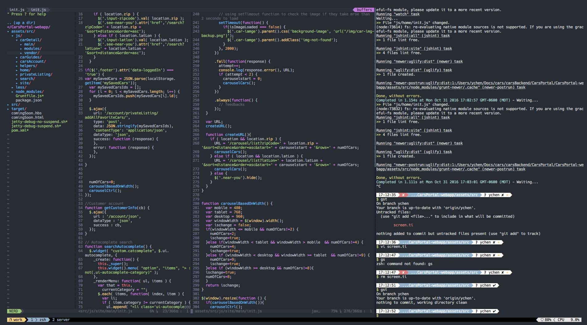
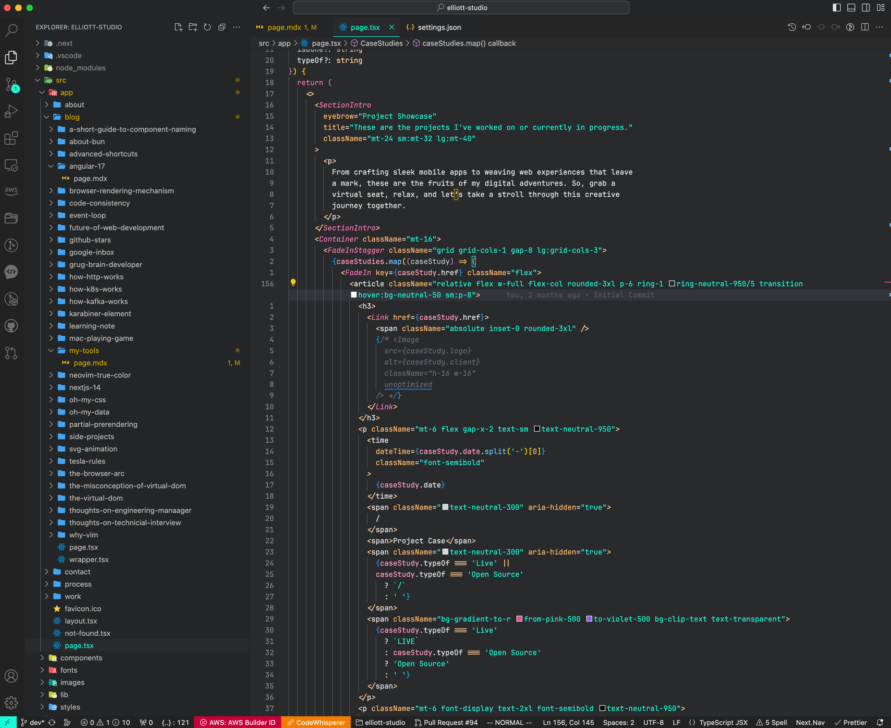
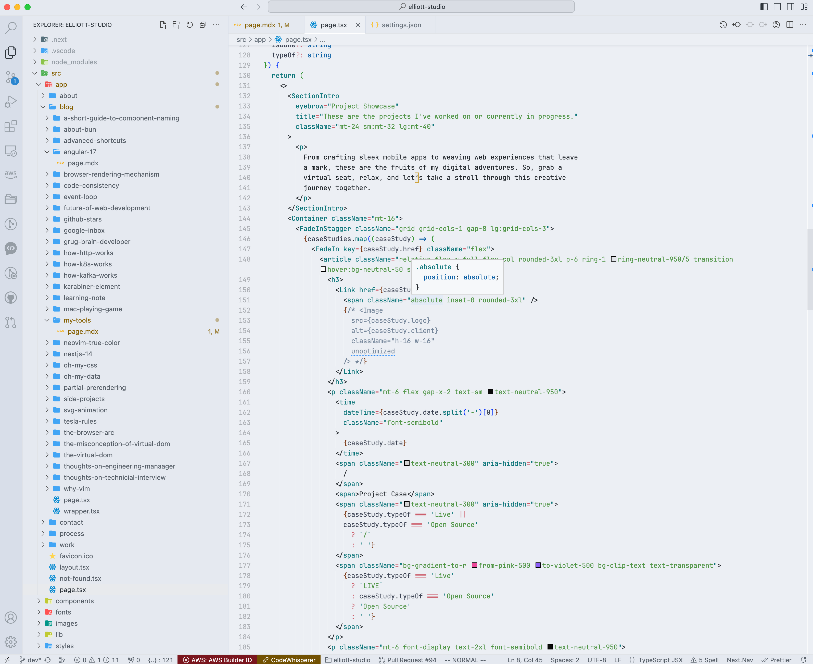

# Introduction

Having the right set of tools makes work not work!

# Dotfiles


10/31/2016

Vim Color Scheme changed to [Vim-One](https://github.com/rakr/vim-one)



## Zsh + Tmux + Vim

| Client           | Themes                                                                     | Fonts                                  | Colors      |
| ---------------- | -------------------------------------------------------------------------- | -------------------------------------- | ----------- |
| Neovim           | [Vim-One](https://github.com/rakr/vim-one)                                 | [Hack](http://sourcefoundry.org/hack/) | #           |
| Tmux             | [Maglev](https://github.com/caiogondim/maglev)                             | Hack                                   | #           |
| Zsh              | [Bullet Train](https://github.com/caiogondim/bullet-train-oh-my-zsh-theme) | #                                      | #           |
| Borderless iTerm | [Spacegray Eighties](https://github.com/mbadolato/iTerm2-Color-Schemes)    | #                                      | BG: #282c34 |

## Borderless iTerm

    ./install.sh 30 30
    ./install.sh 25 25

Padding feature gets implemented into iTerm2 nightly build 3.1.

## Neovim

Neovim is faster than Vim, that's why I use Neovim.

`ctrl` + `h` is a specific Neovim issue, here is the fix:

https://github.com/christoomey/vim-tmux-navigator/issues/71

```
infocmp $TERM | sed 's/kbs=^[hH]/kbs=\\177/' > $TERM.ti
tic $TERM.ti

```

## Enable macOS system key repeats

```bash
$ defaults write com.microsoft.VSCode ApplePressAndHoldEnabled -bool false              # For VS Code
$ defaults write com.microsoft.VSCodeInsiders ApplePressAndHoldEnabled -bool false      # For VS Code Insider
$ defaults write com.vscodium ApplePressAndHoldEnabled -bool false                      # For VS Codium
$ defaults write com.microsoft.VSCodeExploration ApplePressAndHoldEnabled -bool false   # For VS Codium Exploration users
$ defaults delete -g ApplePressAndHoldEnabled                                           # If necessary, reset global default
```

## Blog post about Neovim color

I've written a [blog post](https://www.cyfyifanchen.com/blog/neovim-true-color) on how to change the Neovim color and making it look amazing a long time ago, apparently the analytics shows that this page get hit at least 10 times per a day, so feeling pretty happy about it. Take a look if you want.:)

# Tools

A set of tools I use on a daily basis, and I've written a [ blog post ](https://cyfyifanchen.com/blog/my-tools-my-cave) about it, welcome to have a read.

## System Keymapper: karabiner-element


[Karabiner Elements](https://karabiner-elements.pqrs.org/)

It was, it is, and it will always be the first thing I download on a new machine, making HJKL system-wide available, it's pure magic.

Not only does [ tekezo ](https://github.com/tekezo) make an awesome software for free, but [ tekezo ](https://github.com/tekezo) also keeps it up-to-date with every macOS release, this kinda dedication is phenomenal.

#### Less keystroke does more


The philosophy of shortcut is "less is more" in the sense where can be done intuitively.

Once mapping `hjkl` with `control` as `arrow` key is done, amazing things happen intuitively:

`control` + `h` + `j` + `k` + `l`: `left` `down` `up` `right`.

`control` + `cmd` + `h` or `l`: navigating through beginning and end of a line.

`control` + `cmd` + `shift` + `h` or `l`: select entire line.

`control` + `cmd` + `k` or `j`: top or bottom of the file

`control` + `cmd` + `shift` + `k` or `j`: select entire file from either top or bottom.

`control` + `j` and `control` + `k`: going through intellisense in IDE or up and down when search in Google.

`control` + `l`: very useful to attach parameters to the end of a url.

##### Example of adding a parameter to an url with both hands on home row of keyboard

1. `cmd` + `l`
2. `control` + `l`
3. type the parameter.

or

1. `cmd` + `l`
2. `control` + `e`
3. type the parameter.

Now, how do you feel about this awesome Vim motion in every-day computer use? Pretty great, isn't it? Keep in mind that the philosophy is keeping fingers on the golden row of the keyboard by enabling HJKL Vim motion with KE.

## Editor: Neovim

[Neovim](https://neovim.io/)

Vimmer, That's who I am, that's who I will always be.

## Copy and Paste: Pastebot

[Pastebot](https://tapbots.com/pastebot/)

The universal clipboard is simply a must-have, screenshots and gif can also be put into the clipboard, long history saved, one license across multiple machines, altho it isn't free, but is worth every penny.

## Gif Recorder: Kap

[Kap](https://github.com/wulkano/Kap)

Free and high quality, thinking about contribute to it.

## IDE: VSCode with VSvim

This combination needs NO introduction.

#### Theme

|          Nord Light           |            Panda             |
| :---------------------------: | :--------------------------: |
|  |  |

[ Panda-syntax ](http://panda.siamak.me/) is my favorite dark theme, [ nord light ](https://github.com/nordtheme/nord) is my favorite light theme.

I use Panda at day time, and nord-light at night time.

## Terminal: Tabby

[Tabby](https://github.com/Eugeny/tabby)

This is by far the most comfortable and modern Terminal Simulator I've ever used.

## Shell: Oh-my-zsh

[oh my zsh](https://ohmyz.sh/)

Who doesn't like Z-shell?

There is another shell, called [oh-my-post](https://ohmyposh.dev/), it's pretty cool, but I've not been able to make it work yet. I am gonna list it here anyway. When the config is ready to share, I am gonna come back to update this post.

## Screenshot: Snipaste

[Snipaste](https://www.snipaste.com)

Free and edit all in one, what's the reason not like it?

## Browser: Arc

[Arc](https://arc.net)

It cures my tab syndrome.

## Git: Github Desktop Client

[Github Desktop](https://desktop.github.com)

When the code is ready to commit, switching out from editor, using a different client often fresh my mind a lot. That's why I've been using it.

## Spotlight: Raycast

[Raycast](https://www.raycast.com)

Well, I don't understand why native Spotlight Search doesn't feel smart at all, it can't even open Finder by typing, it drove me nuts all the time.

Raycast, is a great replacement, the window management is something macOS lacks, it's great to have. The command is built for developers I think. It reminds me of Chrome Site Search, once it's configed, it'd be super powerful and productive.

~~But some advanced features need to be unlocked by PRO, that's fine I understand. But integration with Google Translate, c'mon this doesn't have to be a PRO feature.~~

I am looking for some cool integration and commands with Reycast, once I do find them I will share them here.
